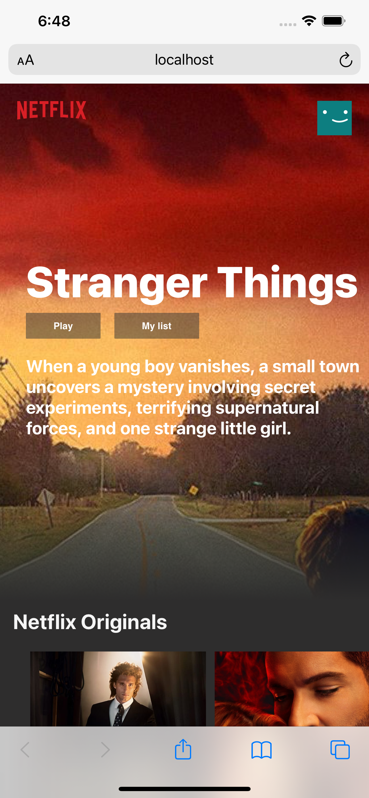

# Netflix Clone

- A Netflix clone to get familiar with React
- The movie data is fetched by using [TMDB API](https://www.themoviedb.org/).
- Implemented by following the [tutorial](https://www.youtube.com/watch?v=XtMThy8QKqU)

- **Live demo**: [here](https://emredogan7.github.io/netflix-clone/)

|      Desktop Browser      |      Mobile Browser       |
| :-----------------------: | :-----------------------: |
|  |  |

April 24, 2021
